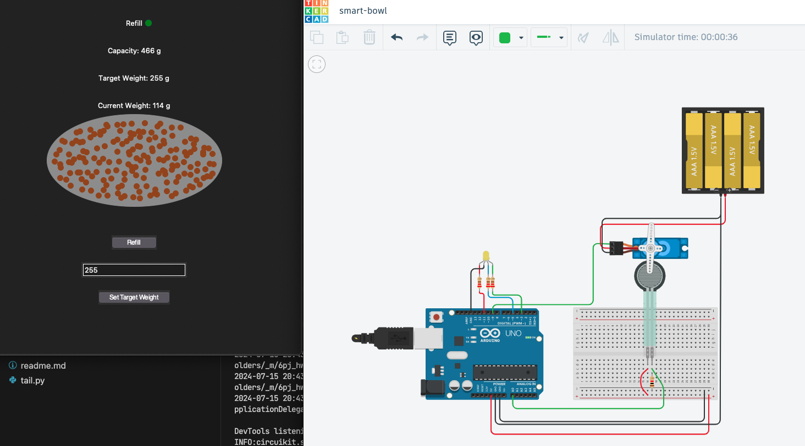

# SmartBowl

## Introduction

The SmartBowl project aims to create an intelligent feeding system for pets. The system automatically dispenses a preset amount of food into a bowl on demand, ensuring pets are fed regularly. Additionally, the system communicates with a user app, providing real-time updates on the food level in the bowl and allowing users to control the feeding process remotely.

## System Design

The SmartBowl system comprises the following components:

- **Microcontroller**: Arduino Uno, which serves as the brain of the system.
- **Sensors**: Weight sensor to measure the amount of food dispensed.
- **Actuators**: Micro Servo to control the food dispensing mechanism.
- **Power Supply**: 4x 1.5V batteries to power the Servo.
- **Indicators**: An LED that indicates the weight in the bowl relative to the target weight, ranging from red (low) to green (at goal or more).
- **Communication**: The system periodically sends sensor data to a user app, which displays the real-time food level and alerts the user via SMS if the bowl is empty.

The user can define a target weight for the food in the bowl through the app and trigger a refill at any time to reach the desired weight.

## Implementation

The implementation involves several steps:

1. **Initialization**: Setting up the Arduino to interface with the sensors and actuators. The servo is connected to a digital pin, and the weight sensor to an analog pin. The LED is connected to several output pins that support PWM to contorl the color.
2. **Logic**: The core logic involves reading the weight sensor to ensure the correct amount of food is dispensed. The system uses event-driven programming to handle updates and commands from the user app.
3. **User App**: The app is a desktop application written in Python. It receives periodic updates from the Arduino (currently sampling it through the serial monitor), displaying the current food level and allowing the user to set the target weight or trigger a refill.

The primary challenge was to transmit data reliably from the Arduino to the app and vice-versa, which was resolved by writing a custom Python package to manage this communication. Both the Arduino and Python software are event-driven, updating specific topics to keep the flow simple and efficient.

## Testing and Results

Testing was conducted manually through Tinkercad simulation. The results are promising, demonstrating that the solution works effectively despite using inexpensive components. The system successfully monitors the food level, updates the user app in real time, and handles user commands to refill the bowl.

## Conclusion

In conclusion, the SmartBowl project successfully achieved its goal of creating an automated pet feeding system with real-time monitoring and user control via a desktop app. Possible future improvements include adding Wi-Fi connectivity and a server to process data, enabling the system to function independently of the user’s computer and while they are away, and providing advanced analytics regarding their pet eating behavior. Additionally, implementing a schedule-based feeding feature could enhance the system's functionality.

Through this **course**, I learned:

- Basic knowledge about microcontrollers and embedded systems, particularly the Atmega architecture.
- How to combine sensors and actuators and work with common protocols.
- Practical experience with Arduino.

Overall, I achieved a functional and innovative project, gaining the confidence to create similar systems for personal use in the future.
